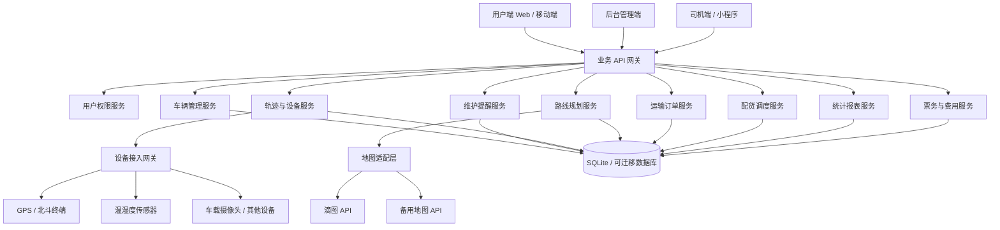
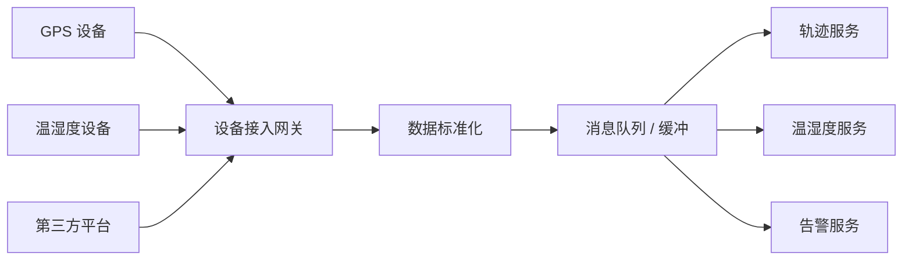

# 兴芮物流车辆管理系统架构设计

## 1. 建设目标

建设一套面向物流运输企业的兴芮物流车辆管理系统，覆盖车辆档案、维护保养、保险税费提醒、轨迹追溯、货箱温湿度采集、路线规划、订单生成与确认、车型配货、统计报表、票务信息和外部设备对接。

系统优先采用轻量化部署，数据库以 SQLite 起步，预留迁移到 PostgreSQL/PostGIS 或第三方云数据库的能力。地图能力采用滴图 API，并通过地图适配层封装，后续可替换为高德、百度、腾讯地图或自建 GIS 服务。

## 2. 总体架构



## 3. 技术选型

| 层级 | 推荐方案 | 说明 |
|---|---|---|
| 前端 | Vue 3 / React | 管理后台、调度大屏、车辆地图监控 |
| 移动端 | H5 / 小程序 / App | 司机接单、订单确认、异常上报 |
| 后端 | Python FastAPI / Node.js NestJS / Java Spring Boot | 推荐 FastAPI，便于快速实现和设备接口扩展 |
| 数据库 | SQLite | 单机或中小规模部署优先 |
| 可扩展数据库 | PostgreSQL + PostGIS | 大规模轨迹、空间查询、报表分析时迁移 |
| 缓存队列 | Redis / 内置任务队列 | 用于提醒、设备数据缓冲、异步计算 |
| 地图 | 滴图 API | 路线规划、地点搜索、地图展示 |
| 设备协议 | HTTP / MQTT / TCP Socket | 预留 GPS、北斗、温湿度终端、车载设备接入 |
| 文件存储 | 本地文件 / S3 兼容对象存储 | 票据、合同、运输单、车辆证照 |

## 4. 功能模块

### 4.1 车辆管理

车辆管理覆盖车辆基础信息、证照信息、维护信息、费用信息、状态管理和生命周期管理。

基础信息包括：

| 字段 | 说明 |
|---|---|
| 车牌号 | 唯一标识 |
| 车辆类型 | 厢货、冷链车、平板车、危化车、半挂车等 |
| 品牌型号 | 车辆品牌、型号、生产年份 |
| 载重 | 最大载重、核定载重 |
| 容积 | 货箱容积 |
| 货箱类型 | 普通、冷藏、恒温、防潮、危险品 |
| 车辆状态 | 空闲、运输中、维修中、停用、年检中 |
| 所属组织 | 分公司、车队、项目部 |
| 驾驶员 | 默认驾驶员或绑定驾驶员 |
| 设备编号 | 绑定 GPS、温湿度设备、摄像设备 |

维护信息包括：

- 保养记录：保养时间、公里数、项目、费用、服务商、附件。
- 维修记录：故障描述、维修项目、配件、费用、维修厂。
- 年检记录：年检日期、到期日期、证照附件。
- 保险记录：保险公司、险种、保单号、生效日期、到期日期、费用。
- 税费记录：车船税、营运证费用、道路运输证费用等。
- 事故记录：事故时间、地点、责任认定、理赔状态、附件。

自动提醒规则：

| 提醒类型 | 触发条件 |
|---|---|
| 保养提醒 | 距上次保养达到设定公里数或时间周期 |
| 保险提醒 | 到期前 30 天、15 天、7 天 |
| 年检提醒 | 到期前 30 天、15 天、7 天 |
| 税费提醒 | 到期前按规则提醒 |
| 证照提醒 | 行驶证、营运证、驾驶证等到期提醒 |

提醒方式：

- 系统站内消息。
- 短信或企业微信/钉钉通知。
- 管理后台待办。
- 司机端提醒。

### 4.2 车辆轨迹追溯

系统通过 GPS/北斗设备采集车辆位置，形成车辆运行轨迹。

采集内容：

| 数据 | 说明 |
|---|---|
| 车辆编号 | vehicle_id |
| 设备编号 | device_id |
| 经度纬度 | lng, lat |
| 速度 | km/h |
| 方向角 | heading |
| 定位时间 | device_time |
| 上报时间 | received_at |
| ACC 状态 | 启停状态 |
| 里程 | odometer |
| 告警 | 超速、离线、偏航、长停 |

轨迹能力：

- 按车辆、订单、时间段查询轨迹。
- 地图轨迹回放。
- 停靠点识别。
- 行驶公里数统计。
- 偏离路线告警。
- 超速、异常停留、设备离线提醒。
- 订单维度保存实际运输路径。

### 4.3 货箱温湿度采集

面向冷链、食品、药品、精密设备等运输场景，支持货箱温湿度实时采集。

采集内容：

| 数据 | 说明 |
|---|---|
| 设备编号 | 温湿度设备唯一编号 |
| 车辆编号 | 绑定车辆 |
| 货箱编号 | 多货箱时区分 |
| 温度 | 摄氏度 |
| 湿度 | 百分比 |
| 电量 | 设备电量 |
| 信号强度 | 网络质量 |
| 上报时间 | received_at |

业务能力：

- 实时温湿度曲线。
- 订单维度温湿度报告。
- 超温、低温、超湿、低湿告警。
- 按货物类型配置温湿度阈值。
- 运输完成后生成温湿度证明附件。

### 4.4 路线规划

路线规划服务负责按订单装卸点、车型、道路偏好和回程规则自动计算运输路线。

核心能力：

- 单点到单点路线规划。
- 多点配送路线规划。
- 多点装货、多点卸货。
- 回程路线规划。
- 回程使用高速优先法测距。
- 输出预计公里数、预计耗时、过路费预估。
- 保存计划路线和实际路线。
- 支持手动调整途经点。

规划输入：

| 字段 | 说明 |
|---|---|
| 起点 | 仓库、工厂、当前位置 |
| 途经点 | 多个装卸点 |
| 终点 | 目的地或回场地点 |
| 车型 | 影响限高、限重、禁行规则 |
| 货物类型 | 普货、冷链、危险品等 |
| 偏好 | 高速优先、距离优先、时间优先、费用优先 |
| 回程规则 | 空车回程、返程接货、高速优先 |

规划输出：

| 字段 | 说明 |
|---|---|
| 计划路径 | 路线 polyline |
| 计划公里数 | km |
| 预计耗时 | 分钟 |
| 预计过路费 | 元 |
| 途经城市 | 可用于票据和统计 |
| 装卸顺序 | 多点任务排序 |
| 地图快照 | 订单附件 |

滴图 API 接入建议：

- 前端地图展示使用滴图 JS API。
- 地点搜索使用 POI 检索能力。
- 路线规划使用驾车路线规划能力。
- 经纬度解析使用地理编码/逆地理编码能力。
- 后端通过地图适配层统一封装，不在业务代码中直接调用地图厂商接口。

滴图注册和接入说明：

1. 访问滴图出行技术开放平台文档站点。
2. 查看 JS API、路线规划、POI 检索、地理编码等文档。
3. 根据平台说明申请 Web 平台 Key、JS 安全密钥或服务端访问凭据。
4. 配置允许访问的域名、IP 白名单和调用配额。
5. 在系统配置表中保存地图服务商、Key、密钥、调用地址和启用状态。

说明：滴图部分能力可能需要商务或平台开通。系统需预留 `MapProvider` 适配接口，避免接入条件变化影响核心业务。

### 4.5 运输订单

订单由调度员创建，也可由路线规划结果自动生成。

订单流程：


订单字段：

| 字段 | 说明 |
|---|---|
| 订单编号 | 系统自动生成 |
| 客户信息 | 客户名称、联系人、电话 |
| 货物信息 | 名称、重量、体积、件数、类型 |
| 装货点 | 可多个 |
| 卸货点 | 可多个 |
| 车辆 | 分配车辆 |
| 驾驶员 | 分配司机 |
| 计划公里数 | 路线规划得出 |
| 实际公里数 | 轨迹计算得出 |
| 预计费用 | 运费、过路费、税费等 |
| 订单状态 | 待确认、已确认、运输中、已完成、已取消 |
| 签收凭证 | 图片、电子签名、回单 |

网上确认订单：

- 客户通过链接或小程序确认。
- 司机通过移动端确认接单。
- 调度员后台审核。
- 订单确认后锁定关键字段。
- 变更订单需生成变更记录。

### 4.6 不同车型配货

配货调度根据货物、车辆、路线和限制条件匹配合适车型。

匹配条件：

| 条件 | 说明 |
|---|---|
| 载重 | 货物重量不得超过车辆核定载重 |
| 容积 | 货物体积不得超过货箱容积 |
| 温控 | 冷链货物必须匹配冷藏车或恒温车 |
| 危险品 | 危险品需匹配对应资质车辆 |
| 路线限制 | 限高、限宽、限重、禁行区域 |
| 车辆状态 | 只能分配空闲、可用车辆 |
| 维护状态 | 即将保养或证照到期车辆禁止或提醒分配 |
| 司机资质 | 驾驶员证照和货物类型匹配 |

推荐算法：

1. 过滤不可用车辆。
2. 按车型能力匹配货物要求。
3. 按距离装货点远近排序。
4. 按车辆利用率、空驶率、回程接货机会打分。
5. 输出推荐车辆列表。

### 4.7 统计、报表与票务

统计报表：

- 车辆利用率。
- 单车运输趟次。
- 单车行驶公里数。
- 计划公里数与实际公里数对比。
- 空驶公里数。
- 运费收入统计。
- 油费、过路费、维修费、保险税费统计。
- 司机工作量统计。
- 客户订单统计。
- 温湿度异常统计。
- 超速、偏航、长停、离线告警统计。

票务信息：

- 过路费票据。
- 油费票据。
- 维修票据。
- 保险票据。
- 税费票据。
- 客户发票信息。
- 运输回单。
- 电子签收单。

票据管理能力：

- 上传图片或 PDF。
- 绑定车辆、订单、费用类型。
- OCR 识别预留。
- 票据审核。
- 导出 Excel、PDF。

## 5. 数据库设计

SQLite 适合中小规模部署，建议使用关系表保存业务数据，轨迹点按时间分表或定期归档。

### 5.1 核心表

#### users 用户表

| 字段 | 类型 | 说明 |
|---|---|---|
| id | INTEGER PK | 用户 ID |
| username | TEXT | 登录名 |
| password_hash | TEXT | 密码哈希 |
| real_name | TEXT | 姓名 |
| phone | TEXT | 手机号 |
| role | TEXT | admin、dispatcher、driver、customer |
| status | TEXT | active、disabled |
| created_at | DATETIME | 创建时间 |

#### vehicles 车辆表

| 字段 | 类型 | 说明 |
|---|---|---|
| id | INTEGER PK | 车辆 ID |
| plate_no | TEXT UNIQUE | 车牌号 |
| vehicle_type | TEXT | 车型 |
| brand_model | TEXT | 品牌型号 |
| load_capacity | REAL | 载重 |
| box_volume | REAL | 容积 |
| box_type | TEXT | 货箱类型 |
| status | TEXT | 状态 |
| driver_id | INTEGER | 默认驾驶员 |
| gps_device_id | TEXT | GPS 设备 |
| sensor_device_id | TEXT | 温湿度设备 |
| created_at | DATETIME | 创建时间 |

#### vehicle_maintenance 车辆维护表

| 字段 | 类型 | 说明 |
|---|---|---|
| id | INTEGER PK | 记录 ID |
| vehicle_id | INTEGER | 车辆 ID |
| type | TEXT | maintenance、repair、inspection |
| title | TEXT | 事项名称 |
| service_date | DATE | 服务日期 |
| mileage | REAL | 当时里程 |
| cost | REAL | 费用 |
| next_due_date | DATE | 下次到期时间 |
| next_due_mileage | REAL | 下次到期公里数 |
| vendor | TEXT | 服务商 |
| remark | TEXT | 备注 |

#### vehicle_certificates 证照保险税费表

| 字段 | 类型 | 说明 |
|---|---|---|
| id | INTEGER PK | 记录 ID |
| vehicle_id | INTEGER | 车辆 ID |
| cert_type | TEXT | insurance、tax、license、transport_permit |
| cert_no | TEXT | 编号 |
| provider | TEXT | 机构 |
| start_date | DATE | 生效日期 |
| end_date | DATE | 到期日期 |
| amount | REAL | 金额 |
| attachment_id | INTEGER | 附件 |
| status | TEXT | normal、expired |

#### devices 设备表

| 字段 | 类型 | 说明 |
|---|---|---|
| id | INTEGER PK | 设备 ID |
| device_no | TEXT UNIQUE | 设备编号 |
| device_type | TEXT | gps、temperature、camera、other |
| protocol | TEXT | http、mqtt、tcp |
| vehicle_id | INTEGER | 绑定车辆 |
| status | TEXT | online、offline、disabled |
| last_seen_at | DATETIME | 最后在线时间 |

#### gps_points 轨迹点表

| 字段 | 类型 | 说明 |
|---|---|---|
| id | INTEGER PK | 点 ID |
| vehicle_id | INTEGER | 车辆 ID |
| order_id | INTEGER | 订单 ID |
| device_no | TEXT | 设备编号 |
| lng | REAL | 经度 |
| lat | REAL | 纬度 |
| speed | REAL | 速度 |
| heading | REAL | 方向 |
| odometer | REAL | 里程 |
| device_time | DATETIME | 设备时间 |
| received_at | DATETIME | 接收时间 |

#### cargo_sensor_records 温湿度记录表

| 字段 | 类型 | 说明 |
|---|---|---|
| id | INTEGER PK | 记录 ID |
| vehicle_id | INTEGER | 车辆 ID |
| order_id | INTEGER | 订单 ID |
| device_no | TEXT | 设备编号 |
| temperature | REAL | 温度 |
| humidity | REAL | 湿度 |
| battery | REAL | 电量 |
| signal | REAL | 信号 |
| received_at | DATETIME | 接收时间 |

#### transport_orders 运输订单表

| 字段 | 类型 | 说明 |
|---|---|---|
| id | INTEGER PK | 订单 ID |
| order_no | TEXT UNIQUE | 订单编号 |
| customer_id | INTEGER | 客户 ID |
| vehicle_id | INTEGER | 车辆 ID |
| driver_id | INTEGER | 司机 ID |
| cargo_name | TEXT | 货物名称 |
| cargo_type | TEXT | 货物类型 |
| cargo_weight | REAL | 重量 |
| cargo_volume | REAL | 体积 |
| planned_distance | REAL | 计划公里数 |
| actual_distance | REAL | 实际公里数 |
| estimated_fee | REAL | 预计费用 |
| actual_fee | REAL | 实际费用 |
| status | TEXT | 状态 |
| confirmed_at | DATETIME | 确认时间 |
| started_at | DATETIME | 开始时间 |
| completed_at | DATETIME | 完成时间 |

#### order_stops 订单站点表

| 字段 | 类型 | 说明 |
|---|---|---|
| id | INTEGER PK | 站点 ID |
| order_id | INTEGER | 订单 ID |
| stop_type | TEXT | pickup、delivery、waypoint、return |
| sequence_no | INTEGER | 顺序 |
| name | TEXT | 地址名称 |
| address | TEXT | 详细地址 |
| lng | REAL | 经度 |
| lat | REAL | 纬度 |
| contact | TEXT | 联系人 |
| phone | TEXT | 电话 |
| planned_arrival | DATETIME | 计划到达 |
| actual_arrival | DATETIME | 实际到达 |

#### route_plans 路线规划表

| 字段 | 类型 | 说明 |
|---|---|---|
| id | INTEGER PK | 路线 ID |
| order_id | INTEGER | 订单 ID |
| provider | TEXT | ditu、amap、baidu |
| preference | TEXT | highway、shortest、fastest、cost |
| planned_distance | REAL | 计划公里数 |
| planned_duration | INTEGER | 预计分钟 |
| toll_fee | REAL | 预估过路费 |
| polyline | TEXT | 路线点 JSON |
| raw_response | TEXT | 地图接口原始响应 |
| created_at | DATETIME | 创建时间 |

#### tickets 票据表

| 字段 | 类型 | 说明 |
|---|---|---|
| id | INTEGER PK | 票据 ID |
| order_id | INTEGER | 订单 ID |
| vehicle_id | INTEGER | 车辆 ID |
| ticket_type | TEXT | toll、fuel、repair、insurance、tax、invoice |
| amount | REAL | 金额 |
| ticket_no | TEXT | 票据号 |
| issued_at | DATE | 开票日期 |
| attachment_id | INTEGER | 附件 |
| status | TEXT | pending、approved、rejected |

## 6. 设备对接接口预留

### 6.1 设备接入网关

设备接入网关负责适配不同厂商设备，不直接把厂商协议写入业务模块。



### 6.2 标准接入接口

GPS 上报：

```http
POST /api/device/gps/report
Content-Type: application/json
```

```json
{
  "device_no": "GPS-001",
  "vehicle_plate": "冀F12345",
  "lng": 115.4801,
  "lat": 38.8739,
  "speed": 68.5,
  "heading": 90,
  "odometer": 120345.6,
  "acc": true,
  "device_time": "2026-06-09T10:30:00+08:00"
}
```

温湿度上报：

```http
POST /api/device/sensor/report
Content-Type: application/json
```

```json
{
  "device_no": "TH-001",
  "vehicle_plate": "冀F12345",
  "box_no": "BOX-1",
  "temperature": 4.2,
  "humidity": 63.5,
  "battery": 88,
  "signal": 72,
  "device_time": "2026-06-09T10:30:00+08:00"
}
```

设备状态上报：

```http
POST /api/device/status
```

```json
{
  "device_no": "GPS-001",
  "status": "online",
  "firmware": "1.0.3",
  "battery": 90,
  "reported_at": "2026-06-09T10:30:00+08:00"
}
```

### 6.3 第三方平台对接

如果设备厂商已有云平台，可通过以下方式对接：

- 厂商主动推送 HTTP Webhook。
- 系统定时拉取厂商 API。
- MQTT 订阅。
- TCP 长连接协议解析。
- 文件批量导入。

系统应保留 `device_vendor_adapters` 表，记录不同厂商的协议、密钥、回调地址和启用状态。

## 7. 后端接口草案

### 7.1 车辆接口

| 方法 | 路径 | 说明 |
|---|---|---|
| GET | /api/vehicles | 车辆列表 |
| POST | /api/vehicles | 新增车辆 |
| GET | /api/vehicles/{id} | 车辆详情 |
| PUT | /api/vehicles/{id} | 修改车辆 |
| GET | /api/vehicles/{id}/maintenance | 维护记录 |
| POST | /api/vehicles/{id}/maintenance | 新增维护记录 |
| GET | /api/vehicles/{id}/certificates | 证照保险税费 |

### 7.2 轨迹接口

| 方法 | 路径 | 说明 |
|---|---|---|
| GET | /api/tracking/live | 实时车辆位置 |
| GET | /api/tracking/vehicles/{id}/history | 历史轨迹 |
| GET | /api/tracking/orders/{id}/path | 订单实际路径 |
| GET | /api/tracking/orders/{id}/distance | 订单实际公里数 |

### 7.3 路线接口

| 方法 | 路径 | 说明 |
|---|---|---|
| POST | /api/routes/plan | 路线规划 |
| POST | /api/routes/multi-stop | 多点路线规划 |
| POST | /api/routes/return | 回程高速优先测距 |
| GET | /api/routes/{id} | 路线详情 |

### 7.4 订单接口

| 方法 | 路径 | 说明 |
|---|---|---|
| POST | /api/orders | 创建订单 |
| GET | /api/orders | 订单列表 |
| GET | /api/orders/{id} | 订单详情 |
| POST | /api/orders/{id}/confirm | 网上确认订单 |
| POST | /api/orders/{id}/assign | 分配车辆和司机 |
| POST | /api/orders/{id}/start | 开始运输 |
| POST | /api/orders/{id}/complete | 完成运输 |

### 7.5 配货接口

| 方法 | 路径 | 说明 |
|---|---|---|
| POST | /api/dispatch/match-vehicles | 按货物匹配车辆 |
| POST | /api/dispatch/assign | 确认派车 |
| GET | /api/dispatch/available-vehicles | 可用车辆 |

### 7.6 报表接口

| 方法 | 路径 | 说明 |
|---|---|---|
| GET | /api/reports/vehicle-utilization | 车辆利用率 |
| GET | /api/reports/order-distance | 订单公里数 |
| GET | /api/reports/costs | 费用统计 |
| GET | /api/reports/sensor-alerts | 温湿度异常 |
| GET | /api/reports/export | 导出报表 |

## 8. 权限设计

| 角色 | 权限 |
|---|---|
| 系统管理员 | 用户、角色、系统配置、地图配置、设备配置 |
| 车队管理员 | 车辆、司机、维护、证照、费用 |
| 调度员 | 订单、路线、配货、派车、跟踪 |
| 司机 | 接单、确认、位置、签收、异常上报 |
| 客户 | 订单确认、运输查询、回单查看 |
| 财务 | 票据、费用、报表、发票 |

## 9. 告警与自动任务

自动任务：

- 每日检查保险、年检、税费、证照到期。
- 每日检查车辆保养周期。
- 每 5 分钟检查设备离线。
- 实时检查温湿度阈值。
- 实时检查车辆偏航、超速、长时间停留。
- 每日生成车辆运行统计。

告警等级：

| 等级 | 场景 |
|---|---|
| 提醒 | 即将到期、保养临近 |
| 警告 | 超温、离线、偏航、证照临近过期 |
| 严重 | 证照已过期、严重超速、冷链持续超温 |

## 10. 地图适配层设计

地图适配接口：

```text
MapProvider
  search_poi(keyword, city)
  geocode(address)
  reverse_geocode(lng, lat)
  plan_driving_route(origin, destination, waypoints, preference, vehicle_type)
  calculate_distance(points, preference)
  render_static_map(route)
```

滴图实现：

```text
DituMapProvider implements MapProvider
```

备用实现：

```text
AmapProvider implements MapProvider
BaiduMapProvider implements MapProvider
MockMapProvider implements MapProvider
```

配置表：

| 字段 | 说明 |
|---|---|
| provider | ditu、amap、baidu |
| api_key | API Key |
| secret | 安全密钥 |
| base_url | 接口地址 |
| enabled | 是否启用 |
| quota_limit | 调用限制 |

## 11. 部署架构

### 11.1 单机部署

适合小型车队或内网部署。

```text
Nginx
  -> 前端静态页面
  -> 后端 API 服务
      -> SQLite
      -> 本地附件目录
      -> 定时任务
```

优点：

- 部署简单。
- 运维成本低。
- 数据在本地。

限制：

- 并发和轨迹数据量有限。
- 多地协同能力弱。
- SQLite 不适合极高频写入。

### 11.2 扩展部署

适合中大型车队。

```text
Nginx / API Gateway
  -> 后端服务集群
  -> PostgreSQL + PostGIS
  -> Redis
  -> 对象存储
  -> 消息队列
  -> 设备接入服务
```

## 12. 数据迁移建议

SQLite 起步时应注意：

- 轨迹表按月份归档。
- 订单、车辆、票据等业务表保留完整索引。
- 定期备份 SQLite 数据库文件。
- 超过 50 辆车、轨迹点超过千万级时，建议迁移 PostgreSQL/PostGIS。

迁移方向：

| 阶段 | 数据库 |
|---|---|
| 试点 | SQLite |
| 小规模生产 | SQLite + 归档 |
| 中大型生产 | PostgreSQL |
| 轨迹空间分析 | PostgreSQL + PostGIS |

## 13. 实施路线

第一阶段：基础管理

- 用户权限。
- 车辆基础信息。
- 司机管理。
- 维护、保险、税费提醒。
- 订单基础流程。

第二阶段：地图与调度

- 滴图 API 接入。
- POI 搜索。
- 单点和多点路线规划。
- 车型配货。
- 计划公里数输出。
- 网上订单确认。

第三阶段：设备与轨迹

- GPS/北斗设备接入。
- 车辆实时位置。
- 历史轨迹回放。
- 实际公里数统计。
- 温湿度传感器接入。
- 温湿度告警和报告。

第四阶段：统计与财务

- 车辆利用率。
- 订单收入和费用统计。
- 票据管理。
- 报表导出。
- 经营分析看板。

第五阶段：优化扩展

- 回程接货优化。
- 多车多点智能调度。
- 轨迹偏航智能告警。
- OCR 票据识别。
- 第三方 TMS、ERP、财务系统对接。

## 14. 风险与注意事项

| 风险 | 建议 |
|---|---|
| 地图 API 权限或配额受限 | 使用地图适配层，预留备用地图服务 |
| 轨迹数据增长快 | 按时间分表、归档，必要时迁移 PostGIS |
| 设备协议不统一 | 建立设备接入网关和厂商适配器 |
| 温湿度数据丢包 | 设备端缓存、服务端补传、异常标记 |
| 订单在线确认法律效力 | 保留确认人、时间、IP、签名或验证码 |
| 车辆证照提醒遗漏 | 定时任务加人工待办双重机制 |
| SQLite 并发限制 | 控制写入频率，设备数据可先入队列 |

## 15. 推荐目录结构

```text
logistics-vehicle-system/
  backend/
    app/
      api/
      services/
      models/
      repositories/
      map_providers/
      device_adapters/
      tasks/
    data/
      logistics.sqlite
    uploads/
  frontend/
    src/
      pages/
      components/
      map/
      reports/
  mobile/
  docs/
  scripts/
```

## 16. 结论

本架构以车辆全生命周期管理为基础，以订单和路线为业务主线，以轨迹和温湿度数据为运输过程证据，以统计报表和票据管理支撑经营分析。系统采用 SQLite 可快速落地，同时通过地图适配层、设备接入网关和数据库迁移设计，保留后续扩展到大型车队和多设备厂商接入的能力。
